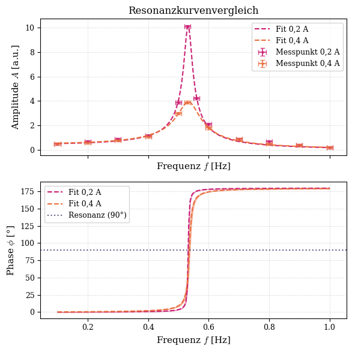
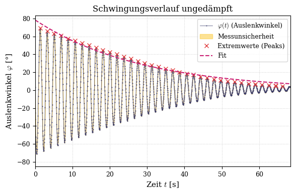
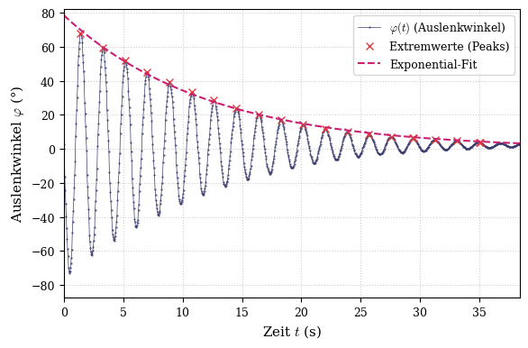
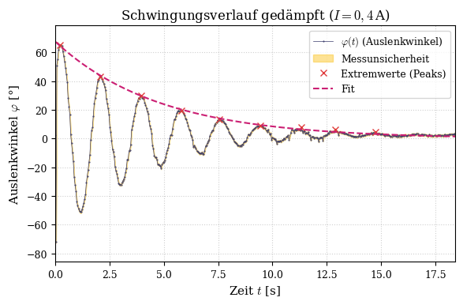
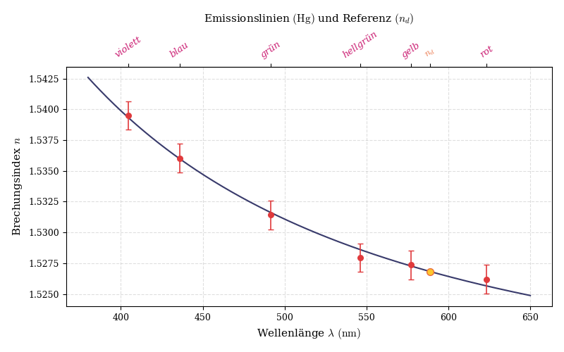

Dieses Repository enthält die Python-Skripte zur Auswertung des Physik-Praktikumsversuchs **M30 (Erzwungene Schwingung)** und **O20 (Brechungsindexbestimmung)**

- [Versuch M30: Erzwungene Schwingung](#versuch-m30-erzwungene-schwingung-pohlsches-drehpendel)
- [Versuch O20: Brechungsindexbestimmung](#versuch-o20-brechungsindexbestimmung-mit-dem-prismenspektralapparat)

##  Voraussetzungen & Bibliotheken

Das Projekt basiert auf Python 3. Um die Skripte auszuführen, werden folgende Bibliotheken benötigt:

* `numpy` (für numerische Berechnungen)
* `pandas` (zum Einlesen der CSV-Daten)
* `matplotlib` (für die Erstellung der Diagramme)
* `scipy` (insbesondere `scipy.optimize.curve_fit` für die Regression)

Die Abhängigkeiten können mittels pip installiert werden:
`pip install numpy pandas matplotlib scipy`

##  Projektstruktur

* `/M30/`: Enthält alles zum Versuch M30
* `/O20/`: Enthält alles zum Versuch O20

#  Versuch M30: Erzwungene Schwingung (Pohlsches Drehpendel)

## Versuchsstruktur

* `/data/`: Enthält die Rohdaten als `.csv`-Dateien.
* `/data/out/`: Speicherort für die vom Skript generierten Diagramme.
* `resonanz_analyse.py`: Analysiert und plottet die angeregte Schwingung
* `schwingung_analyse.py`: Analysiert und plottet die gedämpfte Schwingung
* `frameExtractor.py`: Zieht einen Frame aus dem Rohvideo heraus um Metadaten für die weitere Berechnung zu erhalten

##  Auswertung & Ergebnisse

Die gemessenen Amplituden $A$ wurden gegen die Erregerfrequenz $f$ aufgetragen. Die theoretische Resonanzkurve wurde mit einem gewichteten Fit (unter Berücksichtigung der Ableseunsicherheit) an die Daten angepasst. Die Phasenverschiebung $\phi$ wurde analytisch aus den Fit-Parametern bestimmt.

### Diagramme

*(Hinweis: Für die Einbindung in GitHub wurde die Grafik als PNG gerendert. Für das offizielle Versuchsprotokoll liegen die verlustfreien PDF-Vektorgrafiken im `/data/out/`-Ordner bereit.)*

#  Versuch O20: Brechungsindexbestimmung mit dem PrismenSpektralapparat

### Diagramme

